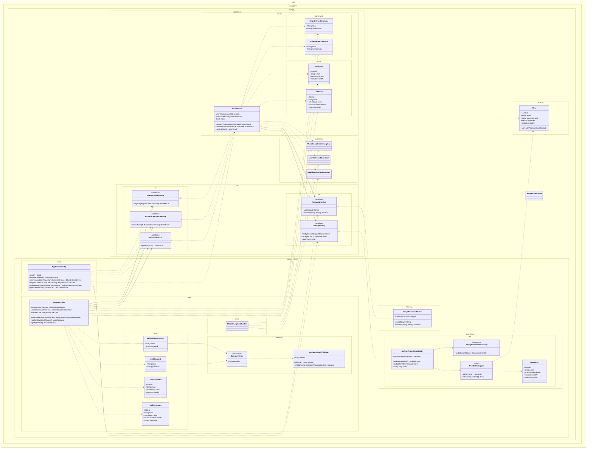
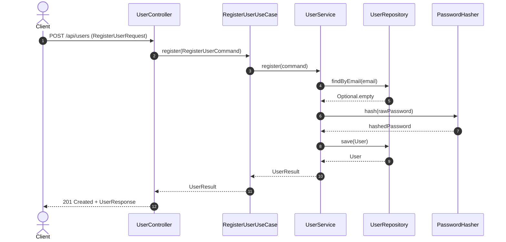
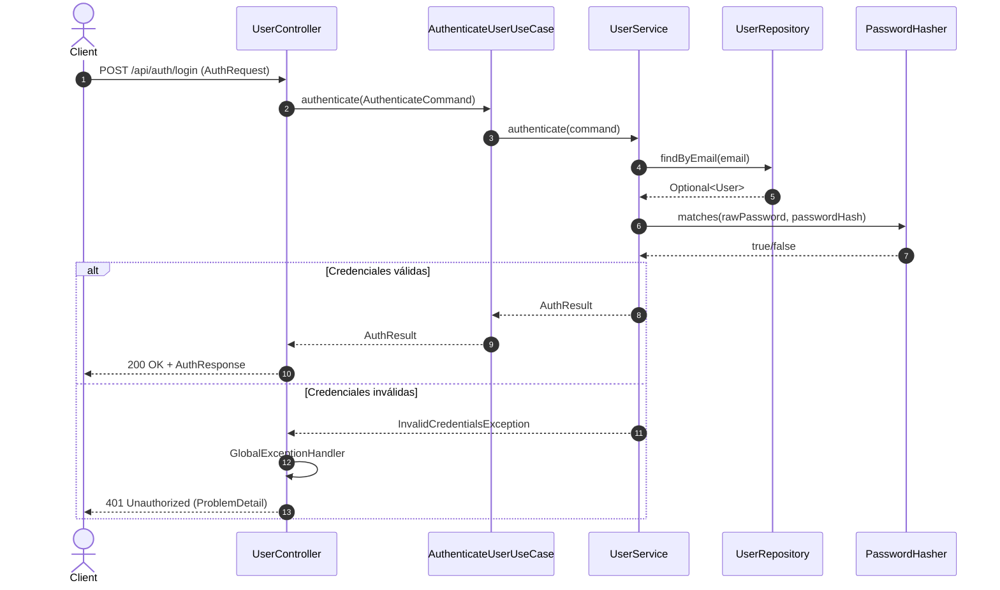
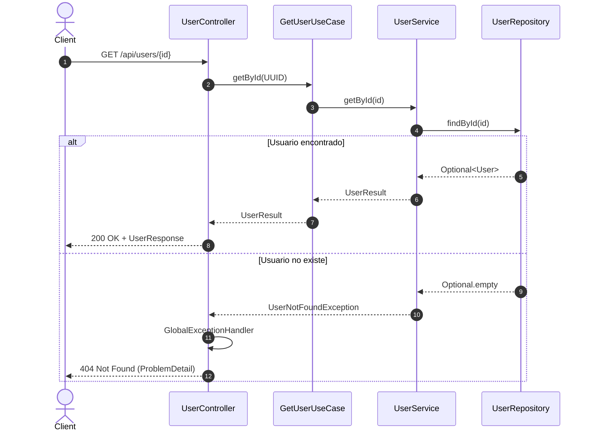

# UML del proyecto

```mermaid
classDiagram
direction LR

namespace com.codigojava.myapp {
  class MyappApplication
}

namespace com.codigojava.myapp.domain {
  class User {
    +UUID id
    +String email
    +String passwordHash
    +Set~String~ roles
    +Instant createdAt
    +User withPasswordHash(String)
  }
}

namespace com.codigojava.myapp.application.port.in {
  class RegisterUserUseCase {
    <<interface>>
    +register(RegisterUserCommand) UserResult
  }
  class AuthenticateUserUseCase {
    <<interface>>
    +authenticate(AuthenticateCommand) AuthResult
  }
  class GetUserUseCase {
    <<interface>>
    +getById(UUID) UserResult
  }
}

namespace com.codigojava.myapp.application.port.out {
  class UserRepository {
    <<interface>>
    +findByEmail(String) Optional~User~
    +findById(UUID) Optional~User~
    +save(User) User
  }
  class PasswordHasher {
    <<interface>>
    +hash(String) String
    +matches(String, String) boolean
  }
}

namespace com.codigojava.myapp.application.service.command {
  class RegisterUserCommand {
    +String email
    +String rawPassword
  }
  class AuthenticateCommand {
    +String email
    +String rawPassword
  }
}

namespace com.codigojava.myapp.application.service.model {
  class UserResult {
    +UUID id
    +String email
    +Set~String~ roles
    +Instant createdAt
  }
  class AuthResult {
    +UUID id
    +String email
    +Set~String~ roles
    +Instant authenticatedAt
    +Instant createdAt
  }
}

namespace com.codigojava.myapp.application.exception {
  class UserAlreadyExistsException
  class UserNotFoundException
  class InvalidCredentialsException
}

namespace com.codigojava.myapp.application.service {
  class UserService {
    -UserRepository userRepository
    -PasswordHasher passwordHasher
    -Clock clock
    +register(RegisterUserCommand) UserResult
    +authenticate(AuthenticateCommand) AuthResult
    +getById(UUID) UserResult
  }
}

namespace com.codigojava.myapp.infrastructure.persistence.jpa {
  class JpaUserRepositoryAdapter {
    -SpringDataUserRepository repository
    +findByEmail(String) Optional~User~
    +findById(UUID) Optional~User~
    +save(User) User
  }

  class SpringDataUserRepository {
    <<interface>>
    +findByEmail(String) Optional~UserEntity~
  }

  class UserEntity {
    +UUID id
    +String email
    +String passwordHash
    +Instant createdAt
    +Set~String~ roles
  }

  class UserEntityMapper {
    <<utility>>
    +toEntity(User) UserEntity
    +toDomain(UserEntity) User
  }
}

namespace com.codigojava.myapp.infrastructure.security {
  class BCryptPasswordHasher {
    -PasswordEncoder delegate
    +hash(String) String
    +matches(String, String) boolean
  }
}

namespace com.codigojava.myapp.infrastructure.web.dto {
  class RegisterUserRequest {
    +String email
    +String password
  }
  class AuthRequest {
    +String email
    +String password
  }
  class UserResponse {
    +UUID id
    +String email
    +Set~String~ roles
    +Instant createdAt
  }
  class AuthResponse {
    +UUID id
    +String email
    +Set~String~ roles
    +Instant authenticatedAt
    +Instant createdAt
  }
}

namespace com.codigojava.myapp.infrastructure.web.validation {
  class CompanyEmail {
    <<annotation>>
    +String domain
  }
  class CompanyEmailValidator {
    -String domain
    +initialize(CompanyEmail)
    +isValid(String, ConstraintValidatorContext) boolean
  }
}

namespace com.codigojava.myapp.infrastructure.web.error {
  class GlobalExceptionHandler
}

namespace com.codigojava.myapp.infrastructure.web {
  class UserController {
    -RegisterUserUseCase registerUserUseCase
    -AuthenticateUserUseCase authenticateUserUseCase
    -GetUserUseCase getUserUseCase
    +register(RegisterUserRequest) ResponseEntity~UserResponse~
    +authenticate(AuthRequest) AuthResponse
    +getById(UUID) UserResponse
  }
}

namespace com.codigojava.myapp.infrastructure.config {
  class ApplicationConfig {
    +clock() Clock
    +passwordHasher() PasswordHasher
    +userService(UserRepository, PasswordHasher, Clock) UserService
    +registerUserUseCase(UserService) RegisterUserUseCase
    +authenticateUserUseCase(UserService) AuthenticateUserUseCase
    +getUserUseCase(UserService) GetUserUseCase
  }
}

RegisterUserUseCase <|.. UserService
AuthenticateUserUseCase <|.. UserService
GetUserUseCase <|.. UserService

UserRepository <|.. JpaUserRepositoryAdapter
PasswordHasher <|.. BCryptPasswordHasher

UserService --> UserRepository
UserService --> PasswordHasher
UserService ..> User
UserService ..> RegisterUserCommand
UserService ..> AuthenticateCommand
UserService ..> UserResult
UserService ..> AuthResult
UserService ..> UserAlreadyExistsException
UserService ..> UserNotFoundException
UserService ..> InvalidCredentialsException

JpaUserRepositoryAdapter --> SpringDataUserRepository
JpaUserRepositoryAdapter ..> UserEntityMapper
UserEntityMapper ..> User
UserEntityMapper ..> UserEntity

UserController --> RegisterUserUseCase
UserController --> AuthenticateUserUseCase
UserController --> GetUserUseCase
UserController ..> RegisterUserCommand
UserController ..> AuthenticateCommand
UserController ..> RegisterUserRequest
UserController ..> AuthRequest
UserController ..> UserResponse
UserController ..> AuthResponse
UserController ..> UserResult
UserController ..> AuthResult

RegisterUserRequest ..> CompanyEmail
AuthRequest ..> CompanyEmail
CompanyEmail ..> CompanyEmailValidator

GlobalExceptionHandler ..> UserAlreadyExistsException
GlobalExceptionHandler ..> UserNotFoundException
GlobalExceptionHandler ..> InvalidCredentialsException

ApplicationConfig ..> UserService
ApplicationConfig ..> UserRepository
ApplicationConfig ..> PasswordHasher
ApplicationConfig ..> RegisterUserUseCase
ApplicationConfig ..> AuthenticateUserUseCase
ApplicationConfig ..> GetUserUseCase
```

## Secuencia: Registro de usuario

```mermaid
sequenceDiagram
autonumber
actor Client
participant UC as UserController
participant RUC as RegisterUserUseCase
participant US as UserService
participant UR as UserRepository
participant PH as PasswordHasher

Client->>UC: POST /api/users (RegisterUserRequest)
UC->>RUC: register(RegisterUserCommand)
RUC->>US: register(command)
US->>UR: findByEmail(email)
UR-->>US: Optional.empty
US->>PH: hash(rawPassword)
PH-->>US: hashedPassword
US->>UR: save(User)
UR-->>US: User
US-->>RUC: UserResult
RUC-->>UC: UserResult
UC-->>Client: 201 Created + UserResponse
```

## Secuencia: Autenticación (login)

```mermaid
sequenceDiagram
autonumber
actor Client
participant UC as UserController
participant AUC as AuthenticateUserUseCase
participant US as UserService
participant UR as UserRepository
participant PH as PasswordHasher

Client->>UC: POST /api/auth/login (AuthRequest)
UC->>AUC: authenticate(AuthenticateCommand)
AUC->>US: authenticate(command)
US->>UR: findByEmail(email)
UR-->>US: Optional<User>
US->>PH: matches(rawPassword, passwordHash)
PH-->>US: true/false

alt Credenciales válidas
  US-->>AUC: AuthResult
  AUC-->>UC: AuthResult
  UC-->>Client: 200 OK + AuthResponse
else Credenciales inválidas
  US-->>UC: InvalidCredentialsException
  UC->>UC: GlobalExceptionHandler
  UC-->>Client: 401 Unauthorized (ProblemDetail)
end
```

## Secuencia: Obtener usuario por id

```mermaid
sequenceDiagram
autonumber
actor Client
participant UC as UserController
participant GUC as GetUserUseCase
participant US as UserService
participant UR as UserRepository

Client->>UC: GET /api/users/{id}
UC->>GUC: getById(UUID)
GUC->>US: getById(id)
US->>UR: findById(id)

alt Usuario encontrado
  UR-->>US: Optional<User>
  US-->>GUC: UserResult
  GUC-->>UC: UserResult
  UC-->>Client: 200 OK + UserResponse
else Usuario no existe
  UR-->>US: Optional.empty
  US-->>UC: UserNotFoundException
  UC->>UC: GlobalExceptionHandler
  UC-->>Client: 404 Not Found (ProblemDetail)
end
```
